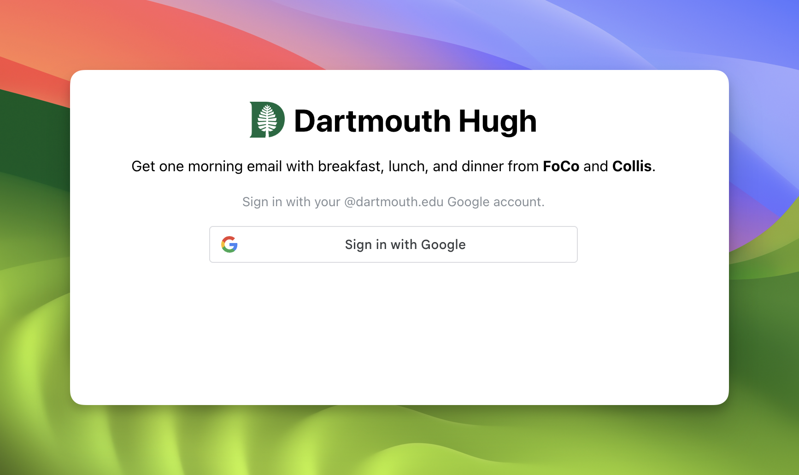
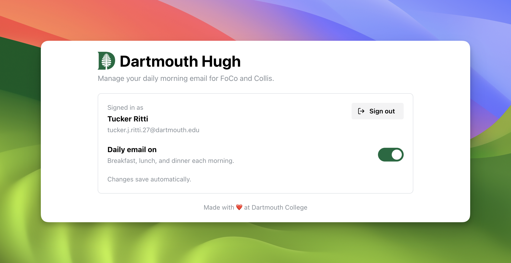
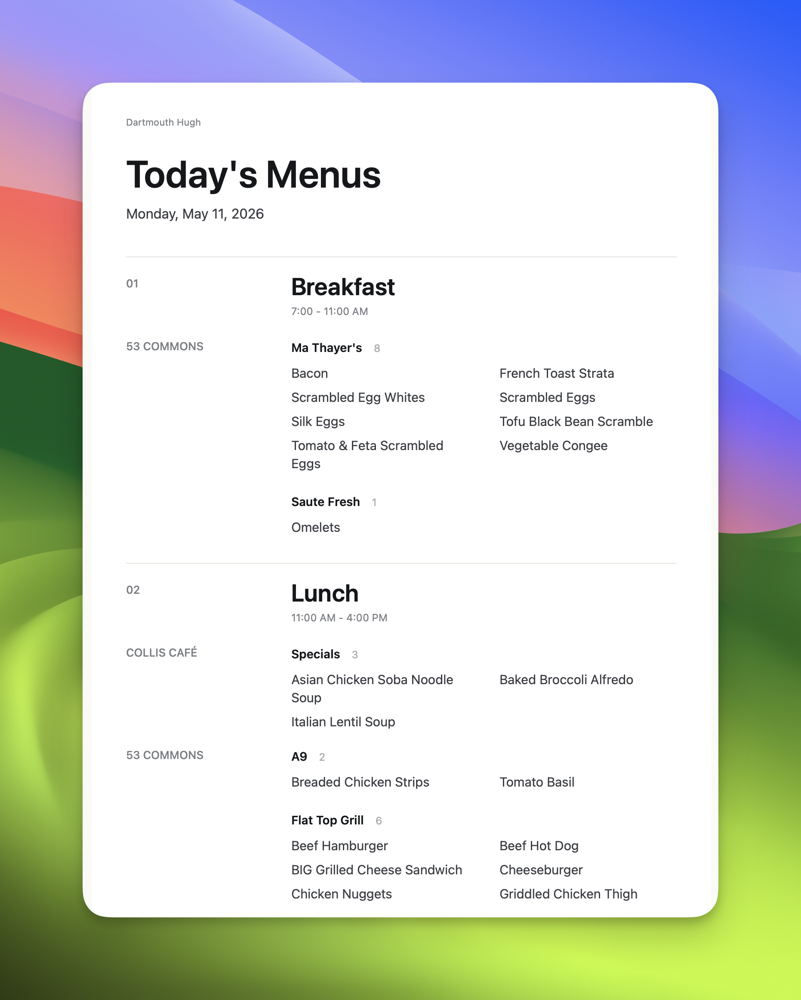

# Dartmouth Hugh

Dartmouth Hugh is a dining menu email tool for Dartmouth students. Instead of checking the dining website multiple times a day, a student signs in with a Dartmouth Google account, chooses whether they want the daily email, and receives one morning digest with breakfast, lunch, and dinner options from FoCo and Collis.

The project connects a few real services:

- Dartmouth Dining API for live menu data
- Google Identity Services for Dartmouth-only sign-in
- Gmail SMTP through Nodemailer for the daily email digest
- PostgreSQL with Prisma for storing subscription preferences

## Deployed Application

- Frontend: [https://hugh.tuckerritti.com](https://hugh.tuckerritti.com)
- Backend API: [https://hugh-api.tuckerritti.com](https://hugh-api.tuckerritti.com)

The frontend is hosted on Vercel. The backend is hosted on a Debian container inside Proxmox.

## Demo Media

### Homepage



### Preferences Portal



### Daily Digest Email



## Running Locally

### Prerequisites

- Bun
- Node.js and npm
- Docker
- A Google OAuth web client ID with `http://localhost:3000` allowed as a JavaScript origin
- A Gmail account and app password for sending email

### Backend

```sh
cd backend
cp .env.example .env
```

Edit `backend/.env` with real values:

- `POSTGRES_PASSWORD`
- `DATABASE_URL`
- `GOOGLE_CLIENT_ID`
- `GMAIL_USER`
- `GMAIL_APP_PASSWORD`
- `FRONTEND_ORIGIN=http://localhost:3000`
- `PORT=4000`

Start the local database and prepare the backend:

```sh
docker compose up -d db
bun install --frozen-lockfile
bun run db:generate
bun run db:migrate
bun run dev
```

The backend runs on `http://localhost:4000`.

### Frontend

In a second terminal:

```sh
cd frontend
cp .env.local.example .env.local
```

Edit `frontend/.env.local`:

```sh
NEXT_PUBLIC_GOOGLE_CLIENT_ID=your-google-oauth-web-client-id.apps.googleusercontent.com
NEXT_PUBLIC_API_URL=http://localhost:4000
```

Install dependencies and start Next.js:

```sh
npm ci
npm run dev
```

The frontend runs on `http://localhost:3000`.

## Learning Journey

I built Dartmouth Hugh because Dartmouth dining information is useful, but checking menus manually is repetitive. A daily email turns that information into something students can glance at while planning their day.

The intended impact is small but practical: students can make faster meal decisions, avoid unnecessary trips to dining locations that do not have what they want, and keep the dining plan process less distracting.

The main new technology I learned through this project was local Docker development. I chose Docker because the backend depends on PostgreSQL, and I wanted the local environment to be repeatable instead of relying on whatever database setup happened to exist on one machine. Running Postgres through Docker made the Prisma workflow easier to document and made the backend closer to something that could later run on a server.

## Technical Rationale

The frontend and backend are separated because they have different responsibilities. The Next.js frontend handles the user-facing flow: Google sign-in, redirecting authenticated users, and letting a user toggle the daily email preference. The Bun/Express backend handles the trusted work: verifying Google ID tokens, enforcing the `@dartmouth.edu` email domain, storing preferences in PostgreSQL, fetching dining data, scheduling the daily digest, and sending email.

The biggest tradeoff was keeping the product simple while still making the backend correct. I chose one daily morning digest instead of a more complex notification system because the use case is planning the day, not sending constant alerts. I also chose strict validation for the Dartmouth Dining API response. If the external API changes shape, the backend should fail clearly instead of silently sending incomplete or misleading menu emails.

Another tradeoff was using Gmail SMTP and BCC delivery. For a small campus utility, that is much simpler than building a full email delivery system. The downside is that it depends on Gmail account configuration and app passwords, so the setup instructions have to be explicit.

The hardest bug was understanding the actual Dartmouth Dining API shape. I initially had assumptions about where menu data lived in the response, but the live payload needed to be inspected directly. The fix was to model the real `{ mealItems }` response, validate it with Zod, and make parser failures explicit. That made the dining pipeline easier to debug because a changed API contract produces a clear error instead of bad downstream behavior.

## AI Usage

I used both Codex and Claude Code while building and documenting this project. I treated them as collaborators: I would describe a problem, use the tools to walk through possible approaches, turn that into a plan, and then adapt the output to the actual project.

The `ai-usage/` folder includes examples of that process:

- `ai-usage/chat export.txt` shows a Claude Code session where I worked through frontend and backend linting/formatting setup, investigated errors, and iterated on fixes.
- `ai-usage/PLAN.md` shows an architecture plan for the dining email subscription portal, including the APIs, backend/frontend split, data model, auth flow, deployment plan, and verification checklist.

One specific way I used AI was to give it architectural direction, then refine the output myself. I told the AI to model the backend after [`xrds-signout-backend`](https://github.com/tuckerritti/xrds-signout-backend), a separate Express backend I wrote without AI and consider a clean, explicit backend structure. That gave the AI a concrete standard for organizing this project around clear files like `app.ts`, `config.ts`, `database.ts`, `routes.ts`, controllers, middleware, and services.

The AI output was useful, but it still needed project-specific correction. I had to compare suggestions against the actual backend and frontend packages, fix issues that showed up when linting failed, and keep the repository's package-manager split consistent with Bun for the backend and npm for the frontend. The same pattern applied to planning: `ai-usage/PLAN.md` was a starting point, but the final project changed as I worked through the real code, including moving to one daily digest, documenting the Docker-based local setup, and replacing loose Dining API assumptions with a strict Zod model of the `{ mealItems }` payload.
